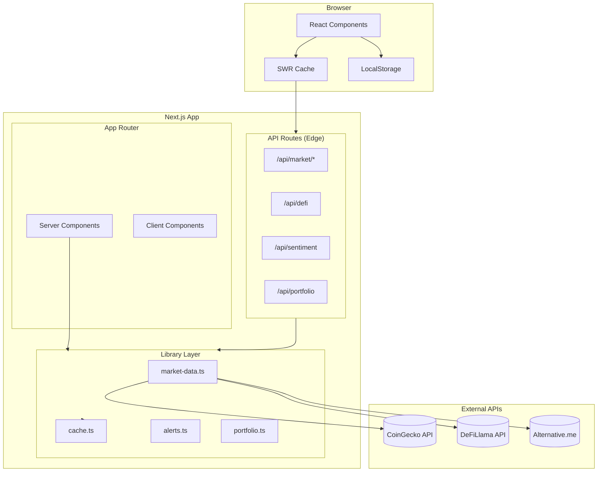
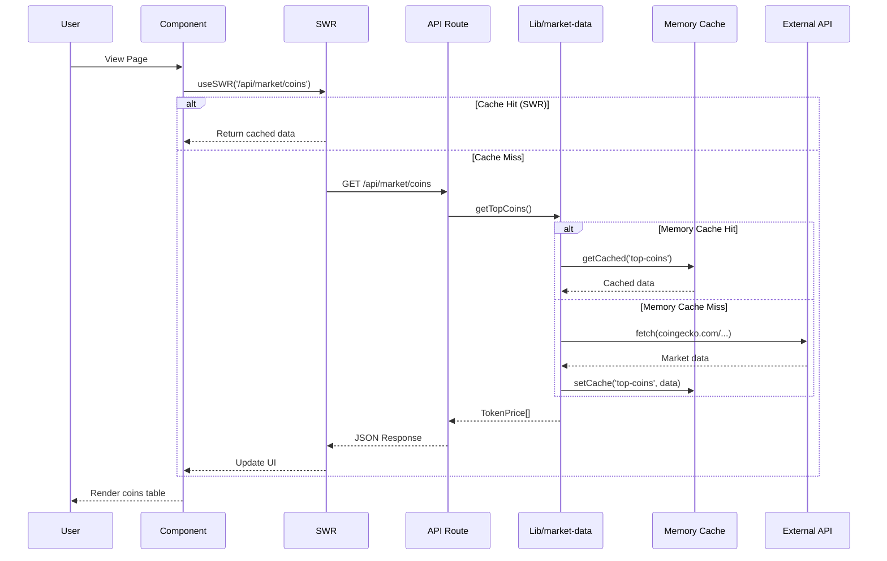
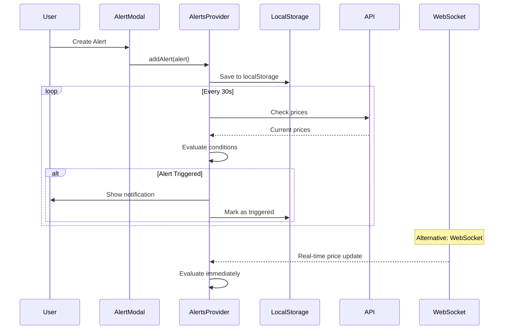
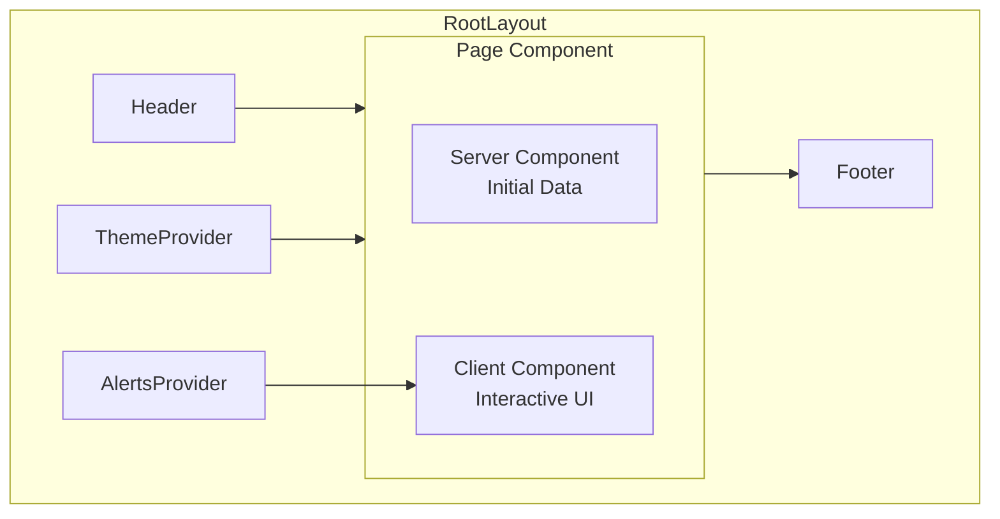
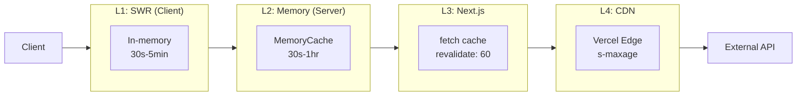
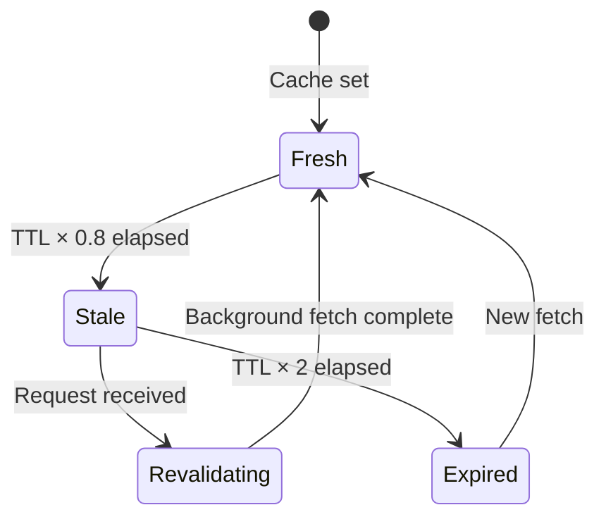
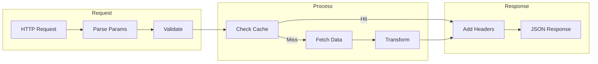
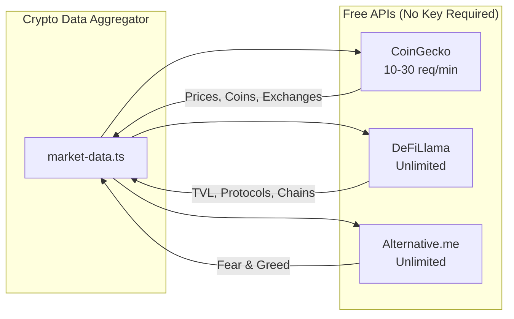
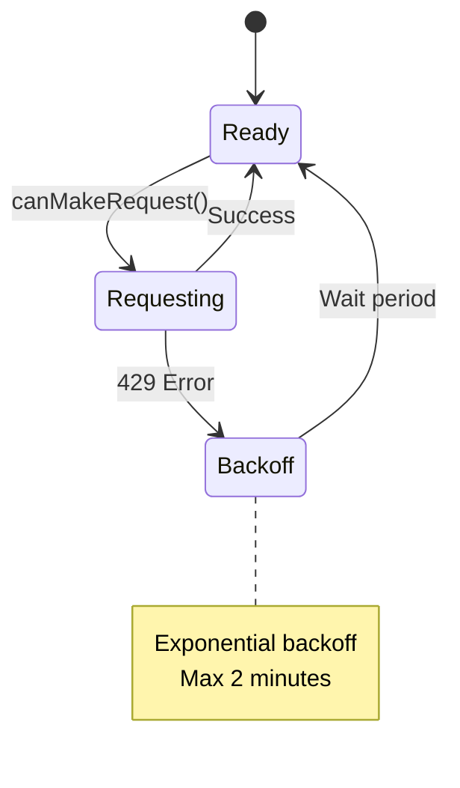

# Architecture

System design and data flow for Crypto Data Aggregator.

---

## Table of Contents

- [Overview](#overview)
- [System Architecture](#system-architecture)
- [Data Flow](#data-flow)
- [Component Architecture](#component-architecture)
- [Caching Strategy](#caching-strategy)
- [API Layer](#api-layer)
- [State Management](#state-management)
- [File Structure](#file-structure)

---

## Overview

Crypto Data Aggregator is a Next.js application that aggregates cryptocurrency market data from
multiple sources. It uses the App Router for routing and server-side rendering, with Edge Runtime
for API routes.

### Key Design Principles

1. **Edge-First** - API routes run on Edge Runtime for low latency
2. **Cache-Heavy** - Multi-layer caching reduces API calls
3. **Progressive Enhancement** - Works without JavaScript, enhanced with it
4. **Zero API Keys Required** - Free tier APIs only (CoinGecko, DeFiLlama)

---

## System Architecture



---

## Data Flow

### Market Data Flow



### Price Alert Flow



### Portfolio Calculation Flow

```mermaid
flowchart LR
    subgraph Input
        H[Holdings<br/>coinId, amount, avgPrice]
    end

    subgraph Fetch
        P[Current Prices<br/>getTopCoins]
    end

    subgraph Calculate
        V[Value = amount × price]
        PL[P&L = value - cost]
        A[Allocation = value / total]
    end

    subgraph Output
        R[PortfolioValue<br/>totalValue, holdings[]]
    end

    H --> V
    P --> V
    V --> PL
    V --> A
    PL --> R
    A --> R
```

---

## Component Architecture

### Page Structure



### Component Hierarchy

```
app/
├── layout.tsx              # Root layout with providers
├── page.tsx                # Home/Markets dashboard
│
├── coin/[coinId]/
│   └── page.tsx            # Coin detail page
│       ├── CoinHeader      # Price, name, stats
│       ├── PriceChart      # Interactive chart
│       ├── MarketStats     # Market data table
│       └── TradingPairs    # Ticker list
│
├── portfolio/
│   └── page.tsx
│       ├── PortfolioSummary
│       ├── HoldingsList
│       └── AddHoldingModal
│
└── defi/
    └── page.tsx
        ├── ProtocolTable
        └── ChainBreakdown
```

---

## Caching Strategy

### Multi-Layer Cache



### Cache TTL Configuration

| Data Type           | Client (SWR) | Server (Memory) | CDN   |
| ------------------- | ------------ | --------------- | ----- |
| Live Prices         | 30s          | 30s             | 60s   |
| Historical (1d)     | 1min         | 60s             | 2min  |
| Historical (7d)     | 5min         | 5min            | 10min |
| Historical (30d)    | 15min        | 15min           | 30min |
| Static (categories) | 1hr          | 1hr             | 2hr   |

### Stale-While-Revalidate



---

## API Layer

### Route Structure

```
src/app/api/
├── market/
│   ├── coins/route.ts          # GET: Coin list
│   ├── snapshot/[coinId]/      # GET: Coin details
│   ├── history/[coinId]/       # GET: Historical data
│   ├── ohlc/[coinId]/          # GET: OHLC candles
│   ├── search/route.ts         # GET: Search
│   ├── compare/route.ts        # GET: Compare coins
│   ├── categories/             # Category endpoints
│   ├── exchanges/              # Exchange endpoints
│   ├── tickers/[coinId]/       # Trading pairs
│   ├── social/[coinId]/        # Social metrics
│   ├── derivatives/route.ts    # Derivatives
│   └── defi/route.ts           # Global DeFi
│
├── defi/route.ts               # DeFi protocols
├── trending/route.ts           # Trending coins
├── sentiment/route.ts          # Fear & Greed
├── charts/route.ts             # Chart data
├── news/route.ts               # News feed
└── portfolio/                  # Portfolio CRUD
    ├── route.ts
    └── holding/route.ts
```

### Request Flow



---

## State Management

### Client State

| State Type  | Storage                | Scope     | Persistence      |
| ----------- | ---------------------- | --------- | ---------------- |
| Server Data | SWR                    | Global    | Memory (session) |
| Theme       | Context + localStorage | Global    | Persistent       |
| Alerts      | Context + localStorage | Global    | Persistent       |
| Watchlist   | localStorage           | Global    | Persistent       |
| Portfolio   | API + localStorage     | User      | Persistent       |
| UI State    | useState/useReducer    | Component | None             |

### Provider Hierarchy

```tsx
<ThemeProvider>
  {' '}
  {/* Theme context */}
  <AlertsProvider>
    {' '}
    {/* Price alerts */}
    <BookmarksProvider>
      {' '}
      {/* Watchlist */}
      <SWRConfig>
        {' '}
        {/* Data fetching */}
        {children}
      </SWRConfig>
    </BookmarksProvider>
  </AlertsProvider>
</ThemeProvider>
```

---

## File Structure

```
crypto-data-aggregator/
│
├── src/
│   ├── app/                    # Next.js App Router
│   │   ├── api/                # API routes (Edge Runtime)
│   │   ├── coin/[coinId]/      # Dynamic coin pages
│   │   ├── markets/            # Market sub-pages
│   │   ├── layout.tsx          # Root layout
│   │   └── page.tsx            # Home page
│   │
│   ├── components/             # React components
│   │   ├── alerts/             # Alert system
│   │   ├── cards/              # Card components
│   │   ├── charts/             # Chart components
│   │   ├── portfolio/          # Portfolio UI
│   │   ├── sidebar/            # Sidebar widgets
│   │   ├── watchlist/          # Watchlist UI
│   │   ├── Header.tsx          # Navigation
│   │   ├── Footer.tsx          # Footer
│   │   └── ThemeProvider.tsx   # Theme context
│   │
│   └── lib/                    # Core utilities
│       ├── market-data.ts      # CoinGecko/DeFiLlama client
│       ├── cache.ts            # Memory cache
│       ├── api-utils.ts        # Response helpers
│       ├── alerts.ts           # Alert system
│       ├── portfolio.ts        # Portfolio logic
│       └── watchlist.ts        # Watchlist logic
│
├── public/                     # Static assets
│   ├── icons/                  # App icons
│   └── manifest.json           # PWA manifest
│
├── docs/                       # Documentation
│   ├── API.md
│   ├── ARCHITECTURE.md
│   ├── DEPLOYMENT.md
│   └── DEVELOPMENT.md
│
└── package.json
```

---

## External Dependencies

### Data Sources



### Rate Limit Handling



---

## Performance Optimizations

### Bundle Optimization

- **Code Splitting**: Automatic with Next.js App Router
- **Dynamic Imports**: Charts loaded on demand
- **Tree Shaking**: Unused code eliminated
- **Image Optimization**: Next.js Image component

### Runtime Optimization

- **Edge Runtime**: Low latency API responses
- **Streaming**: React Suspense for progressive loading
- **Prefetching**: Link prefetch for navigation
- **Caching**: Multi-layer cache strategy

### Metrics Targets

| Metric | Target  | Current       |
| ------ | ------- | ------------- |
| LCP    | < 2.5s  | ~1.8s         |
| FID    | < 100ms | ~50ms         |
| CLS    | < 0.1   | ~0.05         |
| TTFB   | < 200ms | ~100ms (Edge) |
