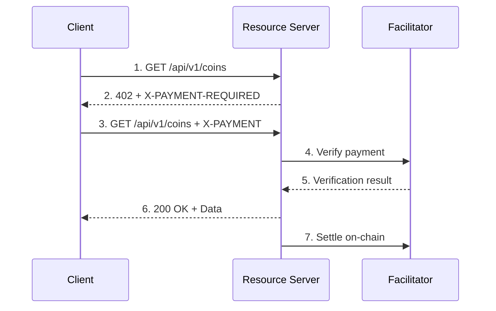

# Authentication

Complete guide to authenticating with the Crypto Data Aggregator API.

---

## Overview

The API supports two authentication methods:

| Method                 | Best For                       | How It Works                      |
| ---------------------- | ------------------------------ | --------------------------------- |
| **API Keys**           | Regular usage, subscriptions   | Traditional header-based auth     |
| **x402 Micropayments** | Pay-per-request, no commitment | Crypto payments via x402 protocol |

!!! info "Free Endpoints"
    Public endpoints (news, search, trending) require **no authentication**.

---

## API Keys

API keys provide traditional authentication with tiered rate limits.

### Getting an API Key

1. Visit [/developers](https://cryptonews.direct/developers)
2. Enter your email address
3. Save your API key (shown only once!)

### Using Your API Key

=== "Header (Recommended)"

    ```bash
    curl -H "X-API-Key: cda_free_xxxxx" \
      https://cryptonews.direct/api/v1/coins
    ```

=== "Query Parameter"

    ```bash
    curl "https://cryptonews.direct/api/v1/coins?api_key=cda_free_xxxxx"
    ```

### API Key Tiers

| Tier           | Rate Limit          | Price     | Features                                 |
| -------------- | ------------------- | --------- | ---------------------------------------- |
| **Free**       | 100 requests/day    | $0        | Basic market data, top 100 coins         |
| **Pro**        | 10,000 requests/day | $29/month | All endpoints, historical data, webhooks |
| **Enterprise** | Unlimited           | $99/month | Dedicated support, SLA, custom endpoints |

### Key Prefixes

Keys are prefixed to indicate tier:

- `cda_free_` - Free tier
- `cda_pro_` - Pro tier
- `cda_ent_` - Enterprise tier

---

## x402 Micropayments

x402 enables pay-per-request access using USDC on Base network. No subscription required.

### How It Works



### Pricing

| Endpoint                 | Price per Request      |
| ------------------------ | ---------------------- |
| `/api/v1/coins`          | $0.001                 |
| `/api/v1/coins/:id`      | $0.001                 |
| `/api/v1/historical/:id` | $0.02 per year of data |
| `/api/v1/export`         | $0.10                  |
| `/api/v1/analytics`      | $0.005                 |
| `/api/v1/screener`       | $0.05                  |

### Using x402 in Code

=== "JavaScript"

    ```javascript
    import { wrapFetch } from '@x402/fetch';
    import { createWalletClient, http } from 'viem';
    import { privateKeyToAccount } from 'viem/accounts';
    import { baseSepolia } from 'viem/chains';

    // Create wallet client
    const account = privateKeyToAccount(process.env.PRIVATE_KEY);
    const walletClient = createWalletClient({
      account,
      chain: baseSepolia,
      transport: http(),
    });

    // Wrap fetch with x402 support
    const x402Fetch = wrapFetch(fetch, walletClient);

    // Make request - payment is handled automatically
    const response = await x402Fetch('https://api.example.com/api/v1/coins');
    const data = await response.json();
    ```

=== "Python"

    ```python
    import requests
    import base64
    import json

    # First request to get payment requirements
    response = requests.get('https://api.example.com/api/v1/coins')

    if response.status_code == 402:
        payment_required = response.headers.get('X-PAYMENT-REQUIRED')
        requirements = json.loads(base64.b64decode(payment_required))

        # Sign payment with your wallet
        payment = sign_x402_payment(requirements)
        payment_header = base64.b64encode(json.dumps(payment).encode()).decode()

        # Retry with payment
        response = requests.get(
            'https://api.example.com/api/v1/coins',
            headers={'X-PAYMENT': payment_header}
        )

        data = response.json()
    ```

---

## Rate Limits

### Response Headers

All authenticated requests include rate limit headers:

```http
X-RateLimit-Limit: 100
X-RateLimit-Remaining: 87
X-RateLimit-Reset: 1706054400000
```

| Header                  | Description                      |
| ----------------------- | -------------------------------- |
| `X-RateLimit-Limit`     | Maximum requests per day         |
| `X-RateLimit-Remaining` | Requests remaining today         |
| `X-RateLimit-Reset`     | Unix timestamp when limit resets |

### Rate Limit by Tier

| Tier       | Daily Limit     | Per-Minute Limit |
| ---------- | --------------- | ---------------- |
| Free       | 100             | 10               |
| Pro        | 10,000          | 100              |
| Enterprise | Unlimited       | 1,000            |
| x402       | Pay-per-request | 1,000            |

---

## Error Handling

### 401 Unauthorized

No valid API key provided.

```json
{
  "error": "Unauthorized",
  "message": "Valid API key required. Get one at /developers"
}
```

### 402 Payment Required

x402 payment needed for this endpoint.

```json
{
  "error": "Payment Required",
  "message": "This endpoint requires payment via x402 protocol",
  "x402Version": 2
}
```

### 429 Too Many Requests

Rate limit exceeded.

```json
{
  "error": "Rate limit exceeded",
  "message": "You have exceeded your Free tier limit",
  "resetAt": "2026-01-24T00:00:00.000Z"
}
```

---

## Comparison: API Keys vs x402

| Feature                | API Keys             | x402                 |
| ---------------------- | -------------------- | -------------------- |
| **Setup**              | Register email       | Connect wallet       |
| **Payment**            | Monthly subscription | Pay per request      |
| **Rate Limits**        | Fixed by tier        | Unlimited (pay more) |
| **Best For**           | Predictable usage    | Variable/low usage   |
| **Anonymity**          | Email required       | Pseudonymous         |
| **Minimum Commitment** | None (free tier)     | $0.001 per request   |

---

## Next Steps

- [Get your API key](https://cryptonews.direct/developers)
- [API Overview](overview.md)
- [x402 Integration](x402.md)
