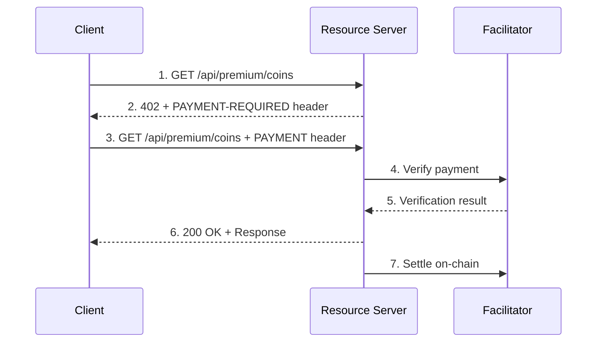

# x402 Payment Protocol

Micropayments for API access using the x402 protocol.

---

## Overview

x402 is an open payment protocol built on HTTP 402 (Payment Required) that enables micropayments for
API access. It's developed by Coinbase and provides a standardized way to monetize APIs with
cryptocurrency payments.

!!! success "Key Benefits"
    - 💵 No fees, 2-second settlement
    - 💰 Micropayments from $0.001
    - 🔓 No API keys required for clients
    - ⚡ Automatic payment handling
    - 🌐 Multi-chain support (Base, Ethereum, Solana)

---

## How It Works



### Flow Explanation

1. **Request**: Client requests a premium endpoint without payment
2. **402 Response**: Server returns `402 Payment Required` with payment requirements
3. **Payment**: Client signs a payment authorization and retries
4. **Verification**: Server verifies payment with facilitator
5. **Response**: If valid, server returns the requested data
6. **Settlement**: Payment is settled on-chain asynchronously

---

## Protocol Headers

| Header | Direction | Purpose |
|--------|-----------|---------|
| `X-PAYMENT-REQUIRED` | Server → Client | Payment requirements (402 response) |
| `X-PAYMENT` | Client → Server | Signed payment authorization |
| `X-PAYMENT-RESPONSE` | Server → Client | Settlement confirmation |

---

## Pricing

| Endpoint | Price per Request |
|----------|------------------|
| `/api/v1/coins` | $0.001 |
| `/api/v1/coins/:id` | $0.001 |
| `/api/v1/historical/:id` | $0.02 per year |
| `/api/v1/export` | $0.10 |
| `/api/v1/analytics` | $0.005 |
| `/api/v1/screener` | $0.05 |
| `/api/premium/ai-analysis` | $0.005 - $0.01 |
| `/api/premium/whales` | $0.005 |

---

## Supported Networks

| Network | Chain ID | Token |
|---------|----------|-------|
| Base Mainnet | `eip155:8453` | USDC |
| Base Sepolia (testnet) | `eip155:84532` | USDC |
| Ethereum Mainnet | `eip155:1` | USDC |
| Solana | `solana:mainnet` | USDC |

---

## Client Integration

### JavaScript with @x402/fetch

```javascript
import { wrapFetch } from '@x402/fetch';
import { createWalletClient, http } from 'viem';
import { privateKeyToAccount } from 'viem/accounts';
import { base } from 'viem/chains';

// Create wallet client
const account = privateKeyToAccount(process.env.PRIVATE_KEY);
const walletClient = createWalletClient({
  account,
  chain: base,
  transport: http(),
});

// Wrap fetch with x402 support
const x402Fetch = wrapFetch(fetch, walletClient);

// Make request - payment is handled automatically!
const response = await x402Fetch('https://cryptonews.direct/api/v1/coins');
const data = await response.json();
console.log(data);
```

### JavaScript with Axios

```javascript
import axios from 'axios';
import { wrapAxiosWithPayment } from '@x402/axios';
import { x402Client } from '@x402/core/client';
import { registerExactEvmScheme } from '@x402/evm/exact/client';
import { privateKeyToAccount } from 'viem/accounts';

const account = privateKeyToAccount(process.env.PRIVATE_KEY);

const client = new x402Client();
registerExactEvmScheme(client, { signer: account });

const axiosClient = wrapAxiosWithPayment(axios.create(), client);

// Payments happen automatically!
const response = await axiosClient.get('https://cryptonews.direct/api/v1/coins');
```

### Python (Manual)

```python
import requests
import base64
import json
from web3 import Web3

def make_x402_request(url, private_key):
    # First request
    response = requests.get(url)
    
    if response.status_code != 402:
        return response.json()
    
    # Parse payment requirements
    payment_required = response.headers.get('X-PAYMENT-REQUIRED')
    requirements = json.loads(base64.b64decode(payment_required))
    
    # Sign payment (simplified - use proper signing library)
    payment = sign_x402_payment(requirements, private_key)
    payment_header = base64.b64encode(json.dumps(payment).encode()).decode()
    
    # Retry with payment
    response = requests.get(url, headers={'X-PAYMENT': payment_header})
    return response.json()

# Usage
data = make_x402_request(
    'https://cryptonews.direct/api/v1/coins',
    'your_private_key'
)
```

---

## Payment Requirements Format

When a protected endpoint is accessed without payment, the server returns:

```json
{
  "x402Version": 2,
  "accepts": [
    {
      "scheme": "exact",
      "network": "eip155:8453",
      "asset": "0x833589fcd6edb6e08f4c7c32d4f71b54bda02913",
      "payTo": "0xYourAddress",
      "maxAmountRequired": "1000",
      "resource": "https://cryptonews.direct/api/v1/coins",
      "description": "Premium API access",
      "mimeType": "application/json",
      "paymentNonce": "unique-nonce-123"
    }
  ]
}
```

### Fields Explained

| Field | Description |
|-------|-------------|
| `scheme` | Payment scheme (`exact` for fixed amount) |
| `network` | Blockchain network (EIP-155 chain ID) |
| `asset` | Token contract address (USDC) |
| `payTo` | Recipient address |
| `maxAmountRequired` | Payment amount in smallest unit |
| `resource` | The endpoint being accessed |
| `paymentNonce` | Unique identifier for this payment |

---

## Payment Payload Format

Client creates a signed payment authorization:

```json
{
  "x402Version": 2,
  "scheme": "exact",
  "network": "eip155:8453",
  "payload": {
    "signature": "0x...",
    "authorization": {
      "from": "0xClientAddress",
      "to": "0xPayToAddress",
      "asset": "0x833589fcd6edb6e08f4c7c32d4f71b54bda02913",
      "amount": "1000",
      "nonce": "unique-nonce-123",
      "validAfter": 1737500000,
      "validBefore": 1737510000
    }
  }
}
```

---

## Settlement Response

After successful payment:

```json
{
  "success": true,
  "transactionHash": "0x...",
  "network": "eip155:8453",
  "settledAt": "2026-01-24T12:00:00Z"
}
```

---

## Testing

### Testnet Setup

1. Get testnet USDC from the [Base Sepolia faucet](https://www.alchemy.com/faucets/base-sepolia)
2. Configure your client for Base Sepolia:

```javascript
import { baseSepolia } from 'viem/chains';

const walletClient = createWalletClient({
  account,
  chain: baseSepolia,  // Testnet
  transport: http(),
});
```

3. Use the testnet API endpoint:

```javascript
const response = await x402Fetch('https://cryptonews.direct/api/v1/coins?network=testnet');
```

---

## Error Handling

### Common Errors

| Error | Cause | Solution |
|-------|-------|----------|
| `insufficient_balance` | Wallet has no USDC | Add USDC to wallet |
| `signature_invalid` | Payment signature invalid | Check signing logic |
| `payment_expired` | Payment nonce expired | Request new nonce |
| `network_mismatch` | Wrong blockchain | Use correct network |

### Example Error Response

```json
{
  "error": "Payment verification failed",
  "code": "insufficient_balance",
  "message": "Your wallet does not have enough USDC",
  "required": "0.001",
  "available": "0.0005"
}
```

---

## Best Practices

1. **Cache Responses** - Avoid paying twice for the same data
2. **Batch Requests** - Combine multiple queries when possible
3. **Use Webhooks** - For real-time data, use WebSocket subscriptions
4. **Monitor Balance** - Set up low balance alerts
5. **Handle Errors** - Implement retry logic for transient failures

---

## Resources

- [x402 Protocol Documentation](https://x402.org)
- [x402 GitHub Repository](https://github.com/coinbase/x402)
- [Base Network](https://base.org)
- [USDC on Base](https://www.circle.com/en/usdc-multichain/base)

---

## Next Steps

- [Get Started with API Keys](authentication.md) - Alternative auth method
- [Market Data API](market-data.md) - Free endpoints
- [Premium Endpoints](premium.md) - Paid features
